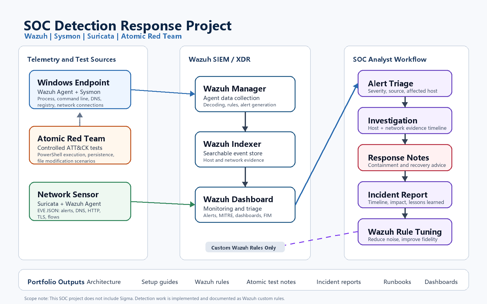

# SOC Detection Response Project

This project documents an open-source SOC detection and response project using **Wazuh**, **Sysmon**, **Suricata**, and **Atomic Red Team**.

The goal is to simulate a practical SOC analyst workflow: collect endpoint and network telemetry, generate controlled ATT&CK-mapped activity, triage alerts, investigate host and network artifacts, write incident reports, and tune custom Wazuh detections.

## Architecture



## Project Scope

This project focuses on an open-source detection and response workflow:

- **Wazuh** for centralized SIEM/XDR alerting and investigation
- **Sysmon** for Windows endpoint telemetry
- **Suricata** for network telemetry through EVE JSON
- **Atomic Red Team** for controlled ATT&CK-mapped test activity
- **Custom Wazuh rules** for detection tuning

This project does not include cross-SIEM rule formats. Detection work is implemented and documented as Wazuh custom rules.

## Target Project Topology

| Machine | Role | Network |
|---|---|---|
| `wazuh-server` | Wazuh Manager / Indexer / Dashboard | VMnet8 NAT + VMnet2 project network |
| `network-sensor` | Suricata gateway and network sensor | VMnet8 NAT + VMnet2 project network |
| `win-endpoint` | Windows test endpoint | VMnet2 project network only |

Planned IP layout:

| Machine | Project IP |
|---|---|
| `network-sensor` | `10.10.10.1/24` |
| `wazuh-server` | `10.10.10.10/24` |
| `win-endpoint` | `10.10.10.20/24` |

## Current Build Status

- VMware project networks created and segmented with VMnet8 NAT and VMnet2 project network
- Ubuntu Server systems installed for Wazuh Server and Network Sensor
- Static project IPs configured on the project network
- Windows Endpoint installed with Sysmon, Wazuh Agent, and Atomic Red Team
- Wazuh Server installed for centralized monitoring
- Network Sensor installed with Suricata and Wazuh Agent
- Initial Windows Sysmon telemetry validated in Wazuh Threat Hunting
- First endpoint detection case documented from PowerShell, Sysmon, and Microsoft Defender activity
- Second endpoint detection case documented from nested PowerShell execution and suspicious file drop evidence
- Network Sensor Suricata telemetry validated in Wazuh Threat Hunting
- Controlled Suricata IDS alert validated from Windows Endpoint test traffic

Latest progress update:

- [2026-07-06 controlled Suricata alert validation](progress-updates/2026-07-06-controlled-suricata-alert-validation.md)
- [2026-07-03 network sensor Suricata validation](progress-updates/2026-07-03-network-sensor-suricata-validation.md)
- [2026-06-30 second endpoint detection case](progress-updates/2026-06-30-second-endpoint-detection-case.md)
- [2026-06-30 first endpoint detection validation](progress-updates/2026-06-30-first-endpoint-detection-validation.md)
- [2026-06-22 core tooling deployment](progress-updates/2026-06-22-core-tooling-deployment.md)

## Detection Case Studies

| Case | Technique / Focus | Data Sources | Status |
|---|---|---|---|
| [001 - PowerShell File Creation Alert](incident-reports/001-powershell-file-creation.md) | PowerShell activity / ATT&CK T1059.001 | Sysmon, Microsoft Defender, Wazuh Agent, Wazuh Threat Hunting | Enriched |
| [002 - PowerShell Spawned Instance and Suspicious File Drop](incident-reports/002-powershell-spawned-instance-file-drop.md) | T1059.001 PowerShell, T1105 Ingress Tool Transfer | Sysmon, Wazuh Agent, Wazuh Threat Hunting | Enriched |
| [003 - Network Sensor Suricata Telemetry Validation](incident-reports/003-network-sensor-suricata-telemetry-validation.md) | Suricata network telemetry validation | Suricata, Wazuh Agent, Wazuh Threat Hunting | Validated |
| [004 - Controlled Suricata Alert Validation](incident-reports/004-controlled-suricata-alert-validation.md) | Controlled IDS alert validation | Suricata, Wazuh Agent, Wazuh Threat Hunting | Validated |

Supporting guide:

- [Windows Defender log collection setup](setup-guides/02-windows-defender-log-collection.md)

## Planned Detection Scenarios

| Scenario | Data Sources | Purpose |
|---|---|---|
| Suspicious PowerShell execution | Sysmon, Wazuh | Investigate suspicious command execution |
| Scheduled task persistence | Sysmon, Wazuh | Detect persistence behavior |
| Registry Run Key persistence | Sysmon, Wazuh | Detect registry-based persistence |
| Critical file modification | Wazuh FIM | Demonstrate integrity monitoring |
| Suspicious network activity | Suricata, Wazuh | Correlate endpoint and network evidence |

## Expected Project Outputs

- Architecture diagram
- VMware project setup notes
- Wazuh deployment notes
- Windows endpoint telemetry setup notes
- Suricata network sensor setup notes
- Atomic Red Team test records
- Custom Wazuh detection rules
- SOC-style incident reports
- Triage runbooks
- Dashboard screenshots
- Lessons learned

## Repository Structure

```text
soc-detection-response-project/
  README.md
  architecture/
  setup-guides/
  progress-updates/
  detections/
    wazuh-rules/
  atomic-tests/
  incident-reports/
  runbooks/
  dashboards/
  screenshots/
  lessons-learned/
```

## Portfolio Goal

This project is designed to demonstrate practical SOC analyst skills:

- SIEM monitoring
- Endpoint log analysis
- Network log analysis
- Alert triage
- MITRE ATT&CK mapping
- Incident timeline creation
- Response recommendation writing
- Detection tuning
- Technical documentation
