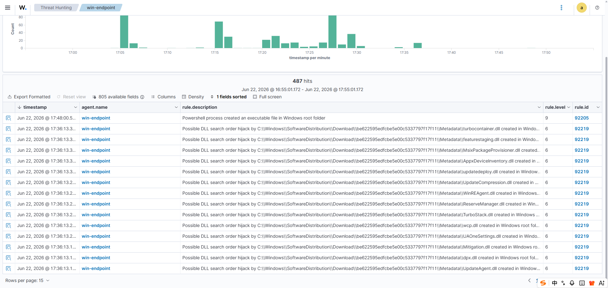
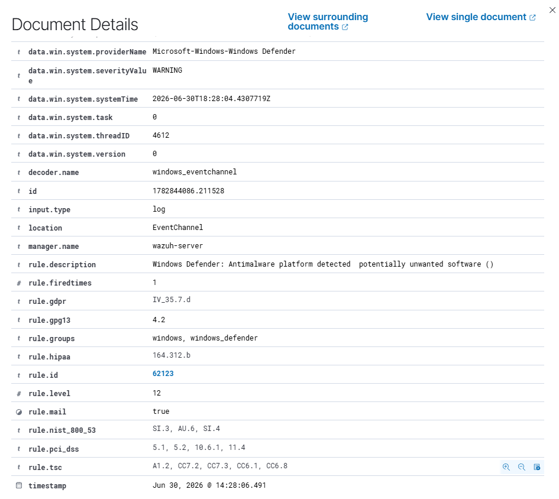

# 001 - PowerShell File Creation Alert

## Objective

Validate that PowerShell activity on the Windows Endpoint can generate endpoint telemetry through Sysmon and surface as an alert in Wazuh Threat Hunting.

## Test Context

Atomic Red Team was used to begin validation for PowerShell activity associated with MITRE ATT&CK technique T1059.001. During the initial test attempt, Microsoft Defender blocked higher-risk activity before it fully executed. Even though no Wazuh alert containing the keyword `mimikatz` was observed, Wazuh did receive related PowerShell/Sysmon telemetry from the Windows Endpoint.

This case documents the validated endpoint telemetry path rather than claiming full execution of the blocked test.

## Environment

| Field | Value |
|---|---|
| Endpoint | `win-endpoint` |
| Endpoint IP | `10.10.10.20` |
| Wazuh Manager | `wazuh-server` |
| Data sources | Sysmon and Microsoft Defender via Wazuh Agent |
| Wazuh view | Threat Hunting |

## Alert Summary

| Field | Value |
|---|---|
| Alert timestamp | June 22, 2026 at approximately 17:48 local time |
| Wazuh rule ID | `92205` |
| Wazuh rule level | `9` |
| Rule description | `Powershell process created an executable file in Windows root folder` |
| Agent name | `win-endpoint` |
| Sysmon channel | `Microsoft-Windows-Sysmon/Operational` |
| Sysmon event ID | `11` |
| Event type | File created |

## Evidence Screenshot

The following screenshot shows the Wazuh Threat Hunting event list for `win-endpoint`, including Wazuh rule `92205`.



The following screenshot shows the Microsoft Defender event in Wazuh for rule `62123`.



## Key Event Fields

Observed fields from Wazuh event details:

```text
agent.name: win-endpoint
agent.ip: 10.10.10.20
data.win.system.channel: Microsoft-Windows-Sysmon/Operational
data.win.system.eventID: 11
data.win.eventdata.image: C:\WINDOWS\System32\WindowsPowerShell\v1.0\powershell.exe
data.win.eventdata.targetFilename: C:\Windows\SystemTemp\__PSScriptPolicyTest_*.ps1
data.win.eventdata.user: NT AUTHORITY\SYSTEM
```

## Defender Event Fields

After Microsoft Defender Operational logs were added to the Windows Wazuh Agent configuration, Wazuh received Defender detection evidence.

Observed Defender event fields:

```text
data.win.system.providerName: Microsoft-Windows-Windows Defender
data.win.system.severityValue: WARNING
data.win.system.systemTime: 2026-06-30T18:28:04.4307719Z
decoder.name: windows_eventchannel
manager.name: wazuh-server
rule.description: Windows Defender: Antimalware platform detected potentially unwanted software ()
rule.groups: windows, windows_defender
rule.id: 62123
rule.level: 12
timestamp: Jun 30, 2026 @ 14:28:06.491
```

## Search Queries Used

Initial broad validation query:

```text
agent.name: "win-endpoint"
```

PowerShell-focused query:

```text
agent.name: "win-endpoint" AND powershell
```

Keyword searches that did not return direct results:

```text
agent.name: "win-endpoint" AND mimikatz
agent.name: "win-endpoint" AND "Invoke-AtomicTest"
```

Defender-focused validation queries:

```text
agent.name: "win-endpoint" AND "Windows Defender"
agent.name: "win-endpoint" AND "Microsoft-Windows-Windows Defender"
```

## Initial Timeline

| Time | Event | Evidence |
|---|---|---|
| Jun 22, 17:48 | PowerShell-related Sysmon activity observed on `win-endpoint` | Wazuh rule `92205` |
| Jun 22, 17:48 | Wazuh alert generated for suspicious PowerShell file creation | Wazuh Threat Hunting |
| Jun 30, 14:28 | Microsoft Defender detection evidence ingested into Wazuh | Wazuh rule `62123` |
| Jun 30, 14:28 | Defender action evidence observed in Wazuh event list | Wazuh rule `62124` |

## Analyst Interpretation

The alert shows `powershell.exe` creating a script file under a Windows system path. This behavior is security-relevant because PowerShell is commonly used for script execution, payload staging, and post-exploitation automation.

In this case, Microsoft Defender blocked the higher-risk Atomic Red Team test attempt, while Wazuh captured related PowerShell file creation telemetry through Sysmon. After Defender Operational log collection was added to the Wazuh Agent configuration, Wazuh also displayed Defender detection evidence. This validates an enriched endpoint detection path:

```text
Windows Endpoint -> Sysmon + Microsoft Defender -> Wazuh Agent -> Wazuh Threat Hunting
```

## Detection Value

This alert is useful for SOC triage because it provides:

- The endpoint where the activity occurred.
- The process responsible for file creation.
- The target file path.
- The Windows event source.
- The Wazuh rule ID and severity.
- Defender detection and protection context.

It also shows why surrounding-event review is important. A file creation alert alone does not prove malicious execution, but it gives analysts a pivot point for process creation, Defender, parent process, and nearby timeline analysis.

## Defender Log Enrichment

Microsoft Defender Operational logs were added to the Windows Wazuh Agent configuration so prevention events can be reviewed alongside Sysmon events.

Implementation guide:

- [Windows Defender log collection setup](../setup-guides/02-windows-defender-log-collection.md)

Validated result:

```text
PowerShell activity + Defender prevention evidence + Sysmon file creation telemetry
```

## Recommended Follow-up

- Review nearby Sysmon Event ID 1 process creation events.
- Check the full PowerShell command line if available.
- Review Windows Defender protection history for blocked content.
- Confirm whether the created file was executed.
- Search for additional PowerShell, script, or encoded command activity.
- If malicious behavior is confirmed, isolate the endpoint and collect forensic evidence.

## Status

Validated:

- Sysmon telemetry is being generated on `win-endpoint`.
- Wazuh Agent is forwarding endpoint events.
- Wazuh Threat Hunting displays PowerShell-related Sysmon alerts.
- Screenshot evidence has been added for Wazuh rule `92205`.
- Windows Defender Operational logs are being forwarded into Wazuh.
- Defender detection evidence has been added for Wazuh rule `62123`.

Needs follow-up:

- Review surrounding documents for process creation context.
