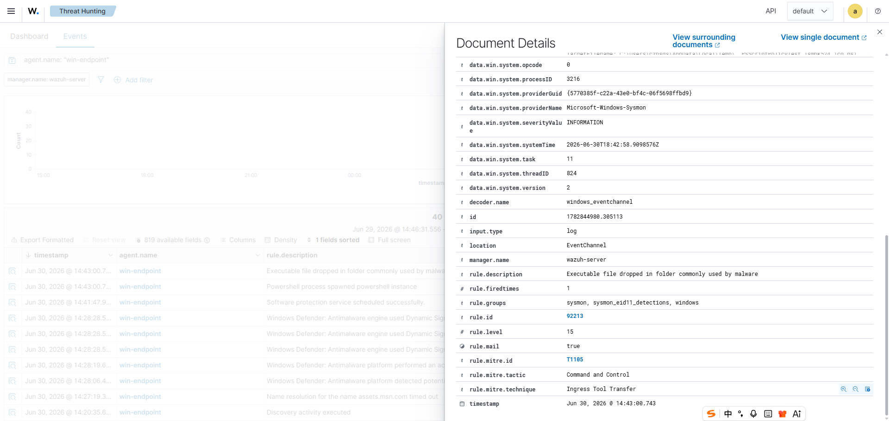
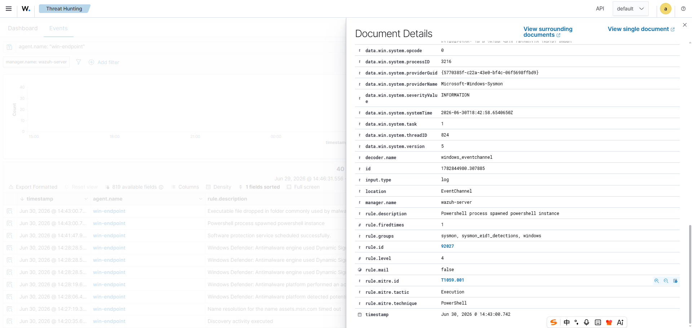

# 002 - PowerShell Spawned Instance and Suspicious File Drop

## Objective

Validate that controlled PowerShell activity on the Windows Endpoint can produce process execution and suspicious file drop evidence in Wazuh.

## Test Context

After validating the first endpoint detection case, a safer PowerShell execution test was used to generate repeatable endpoint telemetry. Wazuh produced two related alerts:

- A PowerShell process spawned another PowerShell instance.
- An executable file was dropped in a folder commonly used by malware.

This case documents the alert evidence and SOC triage value of the related events.

## Environment

| Field | Value |
|---|---|
| Endpoint | `win-endpoint` |
| Wazuh Manager | `wazuh-server` |
| Data source | Sysmon via Wazuh Agent |
| Wazuh view | Threat Hunting |

## Alert Summary

| Rule ID | Rule level | Description | MITRE mapping |
|---|---:|---|---|
| `92027` | 4 | `Powershell process spawned powershell instance` | `T1059.001` PowerShell |
| `92213` | 15 | `Executable file dropped in folder commonly used by malware` | `T1105` Ingress Tool Transfer |

## Evidence Screenshots

Wazuh rule `92213`:



Wazuh rule `92027`:



## Key Event Fields

Observed fields for Wazuh rule `92213`:

```text
data.win.system.providerName: Microsoft-Windows-Sysmon
data.win.system.severityValue: INFORMATION
data.win.system.systemTime: 2026-06-30T18:42:58.9098576Z
decoder.name: windows_eventchannel
manager.name: wazuh-server
rule.description: Executable file dropped in folder commonly used by malware
rule.groups: sysmon, sysmon_eid11_detections, windows
rule.id: 92213
rule.level: 15
rule.mitre.id: T1105
rule.mitre.tactic: Command and Control
rule.mitre.technique: Ingress Tool Transfer
timestamp: Jun 30, 2026 @ 14:43:00.743
```

Observed fields for Wazuh rule `92027`:

```text
data.win.system.providerName: Microsoft-Windows-Sysmon
data.win.system.severityValue: INFORMATION
data.win.system.systemTime: 2026-06-30T18:42:58.6540650Z
decoder.name: windows_eventchannel
manager.name: wazuh-server
rule.description: Powershell process spawned powershell instance
rule.groups: sysmon, sysmon_eid1_detections, windows
rule.id: 92027
rule.level: 4
rule.mitre.id: T1059.001
rule.mitre.tactic: Execution
rule.mitre.technique: PowerShell
timestamp: Jun 30, 2026 @ 14:43:00.742
```

## Enriched Process Creation Fields

Wazuh rule `92027` is backed by Sysmon Event ID `1`, Process Create. The following fields were reviewed from the event details. Local user paths have been normalized as `<lab-user>` for public documentation.

```text
agent.name: win-endpoint
agent.ip: 10.10.10.20
data.win.system.channel: Microsoft-Windows-Sysmon/Operational
data.win.system.eventID: 1
data.win.eventdata.image: C:\Windows\System32\WindowsPowerShell\v1.0\powershell.exe
data.win.eventdata.commandLine: "C:\WINDOWS\System32\WindowsPowerShell\v1.0\powershell.exe" -NoProfile -ExecutionPolicy Bypass -Command "Get-Process | Out-File C:\Users\<lab-user>\AppData\Local\Temp\art_t1059_001_test.txt"
data.win.eventdata.parentImage: C:\Windows\System32\WindowsPowerShell\v1.0\powershell.exe
data.win.eventdata.parentCommandLine: "C:\Windows\System32\WindowsPowerShell\v1.0\powershell.exe"
data.win.eventdata.currentDirectory: C:\WINDOWS\system32\
data.win.eventdata.integrityLevel: High
data.win.eventdata.user: win_endpoint\<lab-user>
data.win.eventdata.parentUser: win_endpoint\<lab-user>
data.win.eventdata.processId: 3428
data.win.eventdata.parentProcessId: 3848
data.win.eventdata.processGuid: {22e48bdf-0e32-6a44-9a04-000000001100}
data.win.eventdata.parentProcessGuid: {22e48bdf-04a8-6a44-0204-000000001100}
data.win.eventdata.hashes: MD5=A97E6573B97B44C96122BFA543A82EA1,SHA256=0FF6F2C94BC7E2833A5F7E16DE1622E5DBA70396F31C7D5F56381870317E8C46,IMPHASH=AFACF6DC9041114B198160AAB4D0AE77
```

The command line confirms a controlled PowerShell test command:

```powershell
Get-Process | Out-File C:\Users\<lab-user>\AppData\Local\Temp\art_t1059_001_test.txt
```

The parent and child process were both `powershell.exe`, which matches the Wazuh rule description: `Powershell process spawned powershell instance`.

## Enriched File Creation Fields

Wazuh rule `92213` is backed by Sysmon Event ID `11`, File Created. The file creation event used the same `processGuid` and `processId` as the PowerShell process creation event, linking both alerts to the same test activity.

```text
agent.name: win-endpoint
agent.ip: 10.10.10.20
data.win.system.channel: Microsoft-Windows-Sysmon/Operational
data.win.system.eventID: 11
data.win.eventdata.image: C:\WINDOWS\System32\WindowsPowerShell\v1.0\powershell.exe
data.win.eventdata.targetFilename: C:\Users\<lab-user>\AppData\Local\Temp\__PSScriptPolicyTest_lsmbk524.1cq.ps1
data.win.eventdata.user: win_endpoint\<lab-user>
data.win.eventdata.processId: 3428
data.win.eventdata.processGuid: {22e48bdf-0e32-6a44-9a04-000000001100}
data.win.eventdata.creationUtcTime: 2026-06-30 18:42:58.902
```

The shared process context links the two alerts:

| Field | Rule `92027` | Rule `92213` |
|---|---|---|
| Process ID | `3428` | `3428` |
| Process GUID | `{22e48bdf-0e32-6a44-9a04-000000001100}` | `{22e48bdf-0e32-6a44-9a04-000000001100}` |
| Image | `powershell.exe` | `powershell.exe` |

## Search Query Used

The initial Wazuh Threat Hunting query was intentionally broad:

```text
agent.name: "win-endpoint"
```

Useful follow-up queries:

```text
agent.name: "win-endpoint" AND "Powershell process spawned powershell instance"
agent.name: "win-endpoint" AND "Executable file dropped"
agent.name: "win-endpoint" AND rule.id:92027
agent.name: "win-endpoint" AND rule.id:92213
agent.name: "win-endpoint" AND data.win.system.providerName:"Microsoft-Windows-Sysmon"
```

## Timeline

| Time | Event | Evidence |
|---|---|---|
| Jun 30, 14:43:00.742 | PowerShell process spawned a PowerShell instance | Wazuh rule `92027` |
| Jun 30, 14:43:00.743 | File drop activity detected in a folder commonly used by malware | Wazuh rule `92213` |
| Jun 30, 14:43:00.743 | Process and file events linked by matching Process GUID and Process ID | Sysmon Event ID `1` and `11` |

## Analyst Interpretation

The alerts indicate two behaviors that are useful for SOC triage:

- Nested PowerShell execution, which can be seen in living-off-the-land execution chains.
- File drop behavior in a location commonly associated with malware staging or tool transfer.

The two events occurred within the same second and share the same `processGuid` and `processId`, making them related evidence from the same PowerShell activity. The rule `92027` event maps to PowerShell execution under ATT&CK `T1059.001`, while rule `92213` maps to `T1105` Ingress Tool Transfer.

This does not automatically prove malicious activity, but it provides a strong investigation pivot. In this case, the command line shows a controlled test command writing process output to a temporary file. An analyst should still review command-line arguments, parent process details, user context, file path, file hash, and nearby Defender or Sysmon events.

## Detection Value

This case demonstrates:

- Wazuh correlation from Sysmon process and file activity.
- MITRE ATT&CK mapping in Wazuh alert details.
- The value of reviewing alerts as a timeline rather than as isolated events.
- A repeatable endpoint-focused detection workflow suitable for SOC documentation.

## Recommended Follow-up

- Review the single-document view for full command-line and parent-process fields.
- Search for additional Sysmon Event ID 1 process creation events around the same timestamp.
- Search for Sysmon Event ID 11 file creation events around the same timestamp.
- Validate whether Microsoft Defender produced any related detection or prevention event.
- Capture file path, hash, and user context if available.
- If malicious behavior is confirmed, isolate the endpoint and preserve forensic evidence.

## Status

Validated:

- Wazuh received Sysmon-based process execution telemetry.
- Wazuh received Sysmon-based suspicious file drop telemetry.
- MITRE mappings were visible for `T1059.001` and `T1105`.
- Screenshot evidence was captured for both alerts.
- Full command-line, parent-process, file path, hash, user, process ID, and process GUID fields were reviewed.
- Sysmon Event ID `1` and Event ID `11` were linked by matching process context.

Needs follow-up:

- Determine whether the dropped file was blocked, executed, or only created.
