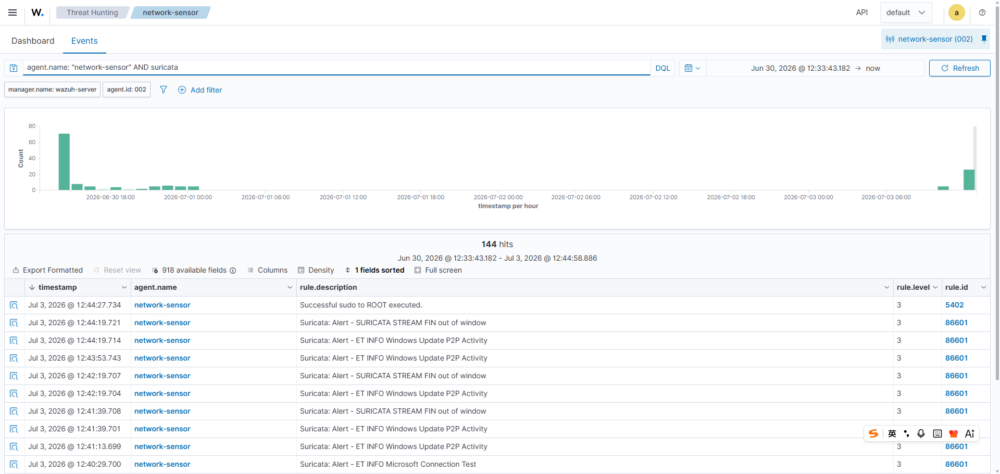

# 003 - Network Sensor Suricata Telemetry Validation

## Objective

Validate that Suricata telemetry from the Network Sensor is being collected by the Wazuh Agent and is searchable in Wazuh Threat Hunting.

## Test Context

After validating endpoint telemetry from `win-endpoint`, the next step was to confirm that network telemetry from `network-sensor` is visible in Wazuh. This case validates the data pipeline for Suricata events before using the network sensor for deeper endpoint and network correlation.

This case is not intended to prove malicious activity. It validates that the network sensor is producing Suricata alerts and that Wazuh can ingest and display them.

## Environment

| Field | Value |
|---|---|
| Sensor | `network-sensor` |
| Wazuh Agent ID | `002` |
| Wazuh Manager | `wazuh-server` |
| Data source | Suricata via Wazuh Agent |
| Wazuh view | Threat Hunting |

## Evidence Screenshot

Wazuh Threat Hunting query for `network-sensor` Suricata events:



## Search Query Used

```text
agent.name: "network-sensor" AND suricata
```

## Observed Results

The Wazuh Threat Hunting view showed `144` hits for the selected time range:

```text
Jun 30, 2026 @ 12:33:43.182 - Jul 3, 2026 @ 12:44:58.886
```

Example Suricata-related alerts observed from `network-sensor`:

| Rule ID | Rule level | Description |
|---|---:|---|
| `86601` | 3 | `Suricata: Alert - SURICATA STREAM FIN out of window` |
| `86601` | 3 | `Suricata: Alert - ET INFO Windows Update P2P Activity` |
| `86601` | 3 | `Suricata: Alert - ET INFO Microsoft Connection Test` |

## Analyst Interpretation

The key finding is that `network-sensor` is now contributing network telemetry into the centralized Wazuh view. This confirms that the Suricata-to-Wazuh ingestion path is working:

```text
Network Sensor -> Suricata -> Wazuh Agent -> Wazuh Manager -> Wazuh Threat Hunting
```

The observed events are mostly informational or low-severity network alerts. For this validation stage, the content of the alerts is less important than proving that Suricata alerts are visible, searchable, and tied to the correct Wazuh agent.

This creates the foundation for future correlation work where endpoint alerts from `win-endpoint` can be compared with network telemetry from `network-sensor` during the same time window.

## Detection Value

This case demonstrates:

- Suricata event ingestion into Wazuh.
- Network sensor visibility in Wazuh Threat Hunting.
- Agent-based separation between endpoint telemetry and network telemetry.
- A validated base for future endpoint and network correlation.

## Recommended Follow-up

- Capture a single Suricata alert document detail view and record key fields such as source IP, destination IP, protocol, signature, and category.
- Generate controlled network activity from `win-endpoint` and verify whether related Suricata events appear from `network-sensor`.
- Correlate one endpoint event and one Suricata event using a shared time window.
- Tune Suricata/Wazuh rules after repeatable network evidence is collected.

## Status

Validated:

- Wazuh received events from `network-sensor`.
- Suricata alert descriptions were visible in Wazuh Threat Hunting.
- Wazuh Agent ID `002` was associated with `network-sensor`.
- Screenshot evidence was captured for Suricata telemetry visibility.

Needs follow-up:

- Enrich one Suricata alert with full document fields.
- Correlate Suricata telemetry with Windows endpoint activity.
