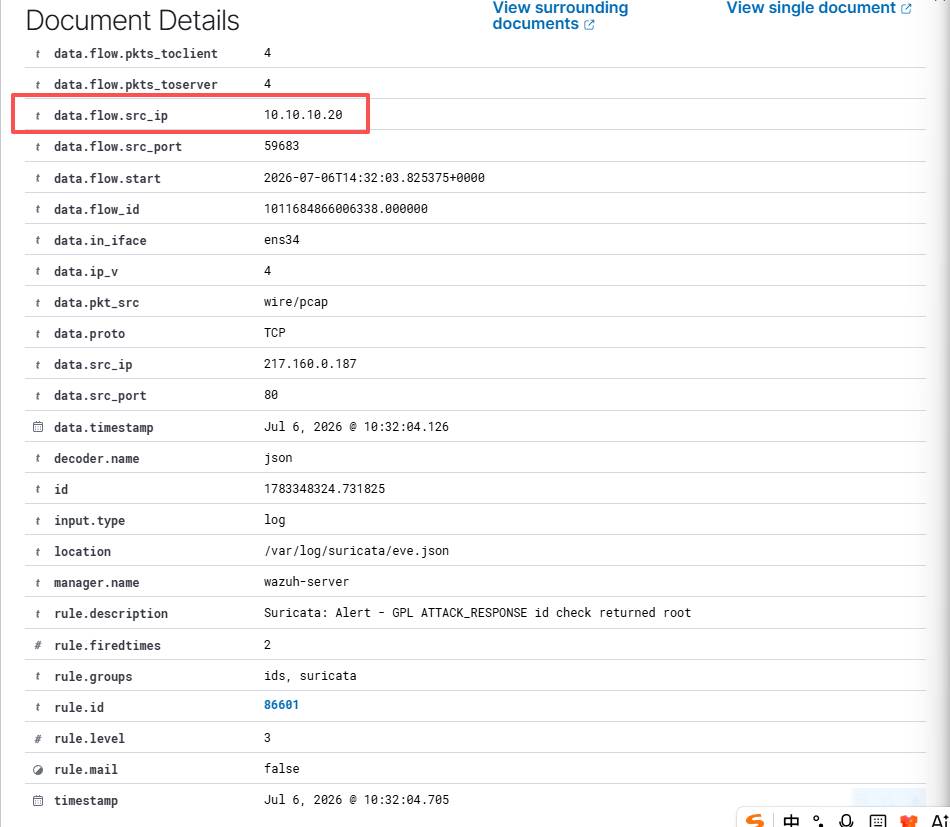
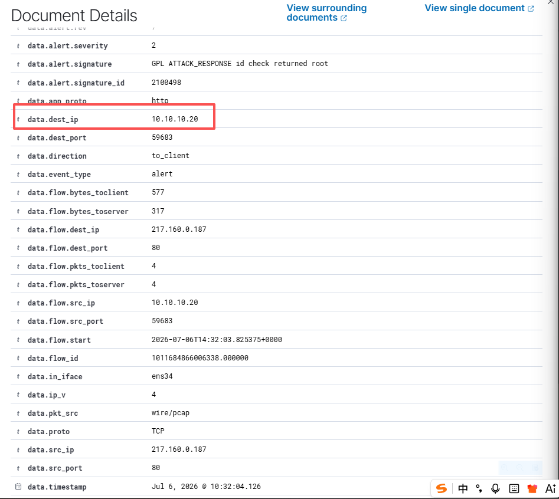

# 004 - Controlled Suricata Alert Validation

## Objective

Validate that a controlled HTTP request from the Windows Endpoint can trigger a Suricata IDS alert on the Network Sensor and that the alert is ingested into Wazuh.

## Test Context

After validating that general Suricata telemetry was visible in Wazuh, a more controlled test was needed. Browser traffic to large HTTPS services can be difficult to attribute because of TLS, QUIC, and DNS over HTTPS. For this case, a known IDS testing site was used to generate a predictable Suricata alert.

The test validates the alerting path:

```text
Windows Endpoint -> Network Sensor -> Suricata -> Wazuh Agent -> Wazuh Manager -> Wazuh Threat Hunting
```

## Environment

| Field | Value |
|---|---|
| Endpoint | `win-endpoint` |
| Endpoint IP | `10.10.10.20` |
| Sensor | `network-sensor` |
| Sensor interface | `ens34` |
| Wazuh Agent ID | `002` |
| Wazuh Manager | `wazuh-server` |
| Data source | Suricata EVE JSON |
| Wazuh view | Threat Hunting |

## Test Activity

A controlled HTTP request was generated from the Windows Endpoint to a public IDS testing endpoint:

```text
http://testmyids.com
```

The response content triggered a known Suricata signature.

## Evidence Screenshots

Suricata alert document details showing the Windows Endpoint as the flow source:



Suricata alert document details showing the IDS signature and Windows Endpoint destination IP:



## Key Event Fields

Observed Wazuh and Suricata fields:

```text
agent.name: network-sensor
agent.id: 002
location: /var/log/suricata/eve.json
decoder.name: json
rule.description: Suricata: Alert - GPL ATTACK_RESPONSE id check returned root
rule.groups: ids, suricata
rule.id: 86601
rule.level: 3
data.event_type: alert
data.alert.signature: GPL ATTACK_RESPONSE id check returned root
data.alert.signature_id: 2100498
data.alert.category: Potentially Bad Traffic
data.alert.severity: 2
data.app_proto: http
data.proto: TCP
data.direction: to_client
data.in_iface: ens34
data.pkt_src: wire/pcap
data.flow.src_ip: 10.10.10.20
data.flow.src_port: 59683
data.flow.dest_ip: 217.160.0.187
data.flow.dest_port: 80
data.src_ip: 217.160.0.187
data.src_port: 80
data.dest_ip: 10.10.10.20
data.dest_port: 59683
data.timestamp: Jul 6, 2026 @ 10:32:04.126
timestamp: Jul 6, 2026 @ 10:32:04.705
```

## Field Interpretation

The alert direction was `to_client`, which explains why the packet-level source appears as the remote HTTP server:

```text
data.src_ip: 217.160.0.187
data.src_port: 80
data.dest_ip: 10.10.10.20
data.dest_port: 59683
```

The flow fields show the original client/server relationship:

```text
data.flow.src_ip: 10.10.10.20
data.flow.src_port: 59683
data.flow.dest_ip: 217.160.0.187
data.flow.dest_port: 80
```

Together, these fields show that the Windows Endpoint initiated the HTTP connection, and the server response triggered the Suricata alert.

## Search Query Used

Initial broad query:

```text
agent.name: "network-sensor" AND suricata
```

Useful focused queries:

```text
agent.name: "network-sensor" AND "GPL ATTACK_RESPONSE"
agent.name: "network-sensor" AND "id check returned root"
agent.name: "network-sensor" AND data.alert.signature:"GPL ATTACK_RESPONSE id check returned root"
```

## Timeline

| Time | Event | Evidence |
|---|---|---|
| Jul 6, 10:32:04.126 | Suricata observed HTTP response traffic related to the controlled test | `data.app_proto: http`, `data.direction: to_client` |
| Jul 6, 10:32:04.126 | Windows Endpoint was confirmed as one side of the flow | `data.flow.src_ip: 10.10.10.20`, `data.dest_ip: 10.10.10.20` |
| Jul 6, 10:32:04.705 | Wazuh displayed the Suricata alert in Threat Hunting | `rule.description: Suricata: Alert - GPL ATTACK_RESPONSE id check returned root` |

## Analyst Interpretation

This alert confirms that the Network Sensor can detect controlled IDS test traffic and forward the Suricata alert to Wazuh. The key validation point is not that the traffic was malicious in this lab context, but that a predictable network alert was generated, ingested, and reviewed with useful fields.

The event also shows why analysts need to interpret direction and flow fields carefully. Because the signature triggered on the HTTP response, `data.src_ip` is the remote server and `data.dest_ip` is the Windows Endpoint. The `data.flow.*` fields preserve the original client-to-server relationship.

## Detection Value

This case demonstrates:

- Controlled Suricata alert generation.
- Wazuh ingestion of Suricata EVE JSON events.
- Identification of the Windows Endpoint in network event fields.
- Basic network alert triage using signature, category, protocol, direction, and flow fields.
- A repeatable foundation for future endpoint and network correlation.

## Recommended Follow-up

- Generate a Windows Endpoint event in the same time window and correlate it with the Suricata alert.
- Build a combined endpoint-plus-network investigation timeline.
- Tune or document Suricata/Wazuh rule handling for low-severity informational IDS alerts.
- Add a response runbook for IDS alerts that map to known test or suspicious network behavior.

## Status

Validated:

- Controlled HTTP test traffic triggered a Suricata IDS alert.
- The alert was ingested into Wazuh from `/var/log/suricata/eve.json`.
- The Windows Endpoint `10.10.10.20` was visible in the alert and flow fields.
- The IDS signature, category, protocol, direction, and Wazuh rule metadata were reviewed.
- Screenshot evidence was captured from Wazuh Document Details.

Needs follow-up:

- Correlate this network alert with an endpoint event from the same time window.
