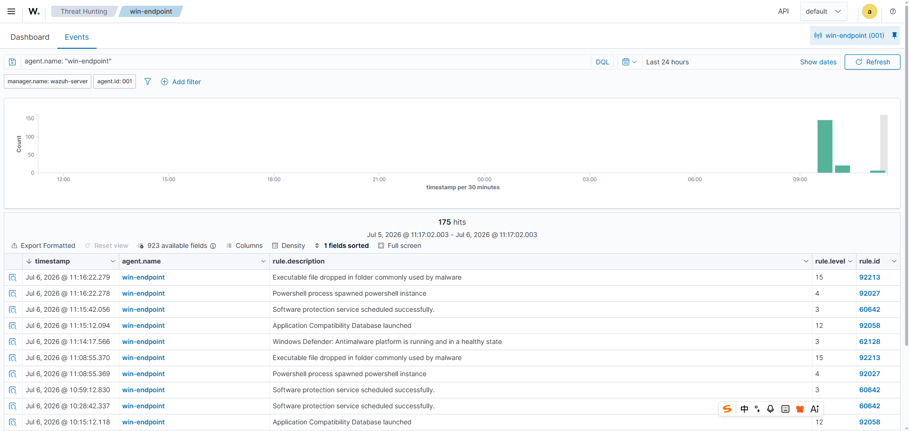
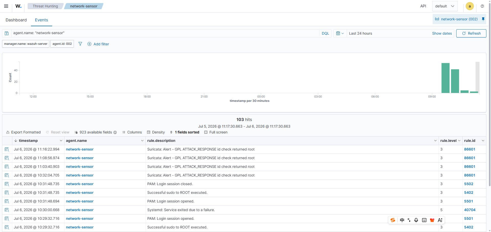

# 005 - Endpoint and Network Telemetry Correlation

## Objective

Correlate endpoint alerts from the Windows Endpoint with network alerts from the Network Sensor during the same controlled test window.

## Test Context

After validating endpoint telemetry and controlled Suricata alerting separately, the next step was to compare both data sources in the same investigation timeline.

The goal of this case is to show that a SOC analyst can pivot between:

- Windows endpoint alerts from `win-endpoint`
- Network IDS alerts from `network-sensor`
- A shared time window around a controlled test activity

This case focuses on correlation using Wazuh alert timing and rule descriptions. Full document-level field enrichment is listed as follow-up work.

## Environment

| Field | Value |
|---|---|
| Endpoint | `win-endpoint` |
| Endpoint IP | `10.10.10.20` |
| Network Sensor | `network-sensor` |
| Wazuh Manager | `wazuh-server` |
| Endpoint data source | Sysmon via Wazuh Agent |
| Network data source | Suricata EVE JSON via Wazuh Agent |
| Wazuh view | Threat Hunting |

## Evidence Screenshots

Endpoint-side Wazuh alerts from `win-endpoint`:



Network-side Wazuh alerts from `network-sensor`:



## Correlated Alerts

Endpoint-side alerts:

| Time | Agent | Rule ID | Description | Level |
|---|---|---:|---|---:|
| Jul 6, 2026 @ 11:16:22.278 | `win-endpoint` | `92027` | `Powershell process spawned powershell instance` | 4 |
| Jul 6, 2026 @ 11:16:22.279 | `win-endpoint` | `92213` | `Executable file dropped in folder commonly used by malware` | 15 |

Network-side alert:

| Time | Agent | Rule ID | Description | Level |
|---|---|---:|---|---:|
| Jul 6, 2026 @ 11:16:22.994 | `network-sensor` | `86601` | `Suricata: Alert - GPL ATTACK_RESPONSE id check returned root` | 3 |

## Timeline

| Time | Event | Evidence |
|---|---|---|
| Jul 6, 2026 @ 11:16:22.278 | Endpoint PowerShell process activity detected | Wazuh rule `92027` on `win-endpoint` |
| Jul 6, 2026 @ 11:16:22.279 | Endpoint file drop behavior detected | Wazuh rule `92213` on `win-endpoint` |
| Jul 6, 2026 @ 11:16:22.994 | Network IDS alert detected from controlled HTTP test response | Wazuh rule `86601` on `network-sensor` |

## Search Queries Used

Endpoint-side broad query:

```text
agent.name: "win-endpoint"
```

Endpoint-side focused queries for future use:

```text
agent.name: "win-endpoint" AND rule.id:92027
agent.name: "win-endpoint" AND rule.id:92213
```

Network-side broad query:

```text
agent.name: "network-sensor"
```

Network-side focused query for future use:

```text
agent.name: "network-sensor" AND rule.id:86601
```

## Analyst Interpretation

The endpoint and network alerts occurred within the same second during the controlled test window. This provides a practical starting point for SOC-style investigation: the analyst can see host-side execution/file activity and network-side IDS activity in the same time range.

The endpoint side produced Wazuh alerts for PowerShell process behavior and file drop behavior. The network side produced a Suricata IDS alert for the controlled HTTP test response. Viewed together, these events demonstrate a basic investigation workflow:

```text
Start with endpoint activity -> pivot to the same time window on network-sensor -> compare IDS evidence
```

This correlation does not claim that every endpoint alert was caused by the Suricata alert. It shows that both telemetry sources can be reviewed together within a shared incident window, which is the operational behavior expected in a SOC triage workflow.

## Detection Value

This case demonstrates:

- Cross-agent review in Wazuh Threat Hunting.
- Endpoint and network evidence visible in the same time window.
- Rule-based pivots using Wazuh rule IDs.
- A repeatable path from endpoint alert triage to network IDS validation.
- The need to preserve timestamps, agent names, rule IDs, and descriptions when building an investigation timeline.

## Recommended Follow-up

- Capture endpoint Document Details for rule `92027` and record command-line, process image, parent image, user, and Sysmon Event ID.
- Capture endpoint Document Details for rule `92213` and record target file path, process ID, and process GUID.
- Capture network Document Details for rule `86601` and record source IP, destination IP, protocol, direction, app protocol, and Suricata signature.
- Add a custom Wazuh rule or runbook step if a specific test marker needs more precise endpoint matching.

## Status

Validated:

- Endpoint-side Wazuh alerts were visible for `win-endpoint`.
- Network-side Suricata alerts were visible for `network-sensor`.
- Endpoint and network events were observed in the same second-level time window.
- Screenshot evidence was captured for both agents.

Needs follow-up:

- Enrich the correlation with document-level command-line and flow fields.
