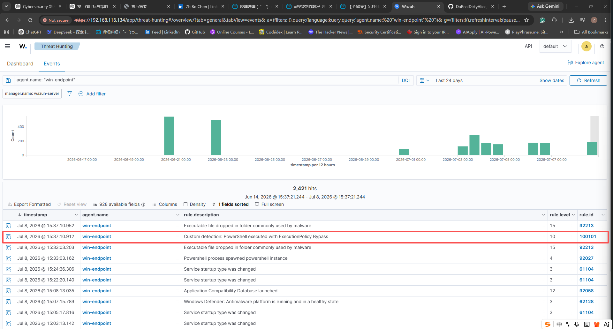
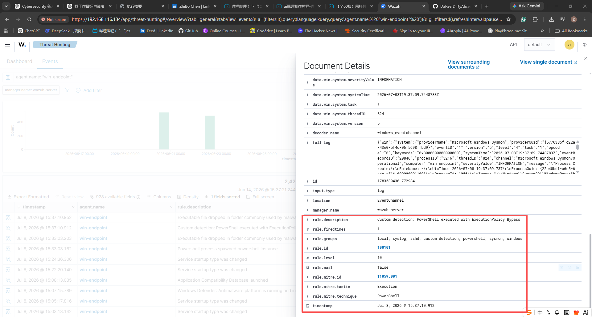

# 007 - Custom Wazuh Rule for PowerShell ExecutionPolicy Bypass

## Objective

Create and validate a custom Wazuh detection rule for suspicious PowerShell execution on the Windows endpoint.

This case moves the project from default alert validation into detection tuning. The goal is to show that a SOC analyst can define a detection condition, test it with controlled activity, and validate the resulting alert in Wazuh.

## Detection Logic

The custom rule detects Sysmon Event ID 1 process creation events where:

- The process image ends with `powershell.exe`
- The command line contains `ExecutionPolicy` and `Bypass`

Custom Wazuh rule:

```xml
<rule id="100101" level="10">
  <if_group>sysmon_event1</if_group>
  <field name="win.eventdata.image" type="pcre2">(?i)powershell\.exe$</field>
  <field name="win.eventdata.commandLine" type="pcre2">(?i).*ExecutionPolicy.*Bypass.*</field>
  <description>Custom detection: PowerShell executed with ExecutionPolicy Bypass</description>
  <mitre>
    <id>T1059.001</id>
  </mitre>
  <group>custom_detection,powershell,sysmon,windows,</group>
</rule>
```

The rule was added to:

```text
/var/ossec/etc/rules/local_rules.xml
```

The project copy is stored at:

```text
detections/wazuh-rules/100101-powershell-executionpolicy-bypass.xml
```

## Environment

| Field | Value |
|---|---|
| Endpoint | `win-endpoint` |
| Endpoint IP | `10.10.10.20` |
| Wazuh Manager | `wazuh-server` |
| Data source | Sysmon Event ID 1 through Wazuh Agent |
| Wazuh view | Threat Hunting |
| Custom rule ID | `100101` |
| MITRE ATT&CK | `T1059.001 - PowerShell` |

## Validation Command

The following command was executed on `win-endpoint`:

```powershell
powershell.exe -NoProfile -ExecutionPolicy Bypass -Command "Get-Process | Out-File $env:TEMP\case007_powershell_bypass.txt"
```

The command intentionally uses `-ExecutionPolicy Bypass` to trigger the custom detection rule.

## Evidence Screenshots

Wazuh Threat Hunting event list showing custom rule `100101`:



Wazuh Document Details showing custom rule metadata and MITRE mapping:



## Alert Evidence

| Field | Value |
|---|---|
| Time | Jul 8, 2026 @ 15:37:10.912 |
| Agent | `win-endpoint` |
| Rule ID | `100101` |
| Rule level | `10` |
| Rule description | `Custom detection: PowerShell executed with ExecutionPolicy Bypass` |
| Rule groups | `custom_detection`, `powershell`, `sysmon`, `windows` |
| MITRE tactic | `Execution` |
| MITRE technique | `PowerShell` |
| MITRE ID | `T1059.001` |

## Search Queries Used

Broad endpoint search:

```text
agent.name: "win-endpoint"
```

Custom rule search:

```text
agent.name: "win-endpoint" AND rule.id:100101
```

Fallback keyword search:

```text
agent.name: "win-endpoint" AND "ExecutionPolicy"
```

## Analyst Interpretation

The custom Wazuh rule successfully triggered after a controlled PowerShell command was executed on `win-endpoint`.

The alert confirms that Wazuh can detect a locally defined behavior instead of relying only on default rule content. This is important because SOC teams often need to tune detections for specific environments, known attacker behaviors, or investigation goals.

The behavior is suspicious because `ExecutionPolicy Bypass` is commonly used to run PowerShell code while avoiding local execution policy restrictions. In this project, the activity was controlled and expected.

## Detection Value

This case demonstrates:

- Custom Wazuh rule creation.
- Sysmon Event ID 1 based detection tuning.
- PowerShell command-line detection.
- MITRE ATT&CK mapping to `T1059.001`.
- Validation of custom rule output in Wazuh Threat Hunting.
- A repeatable test process for detection engineering.

## Response Recommendation

If this alert appears unexpectedly in a production environment:

1. Review the full PowerShell command line.
2. Identify the parent process and user context.
3. Check nearby Sysmon Event ID 1 and Event ID 11 activity.
4. Review Microsoft Defender events in the same time window.
5. Determine whether the command created, downloaded, or executed additional files.
6. Escalate if the activity is not linked to approved administration or automation.

## False Positive Considerations

`ExecutionPolicy Bypass` can appear in legitimate administration scripts, software deployment tooling, or troubleshooting activity.

This rule should not be treated as automatic proof of compromise. It is a high-signal triage indicator that should be reviewed with command-line, parent-process, user, and surrounding-event context.

## Status

Validated:

- Custom Wazuh rule `100101` was created.
- Wazuh configuration test completed successfully before restart.
- Controlled PowerShell test activity was executed on `win-endpoint`.
- Wazuh Threat Hunting displayed the custom rule alert.
- MITRE mapping to `T1059.001` was visible in Document Details.

Needs follow-up:

- Review whether the rule should also match `pwsh.exe`.
- Consider adding a second custom rule for suspicious PowerShell download or encoded command behavior.
- Document a tuning note for expected administrative PowerShell usage.
