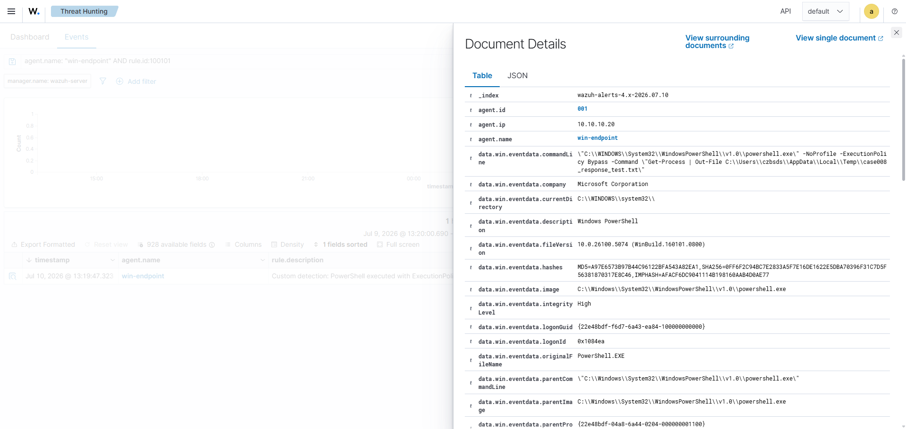
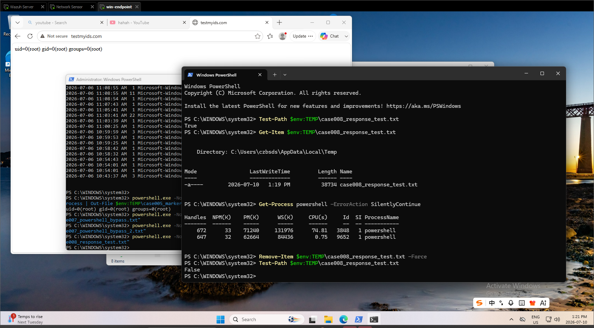

# 008 - Manual Response Workflow for Suspicious PowerShell Alert

## Objective

Validate a manual SOC response workflow after a suspicious PowerShell alert is confirmed in Wazuh.

This case focuses on the response side of the SOC Detection Response Project. Earlier cases validated telemetry, alerting, correlation, runbook creation, and custom Wazuh rule tuning. This case documents how an analyst can move from a confirmed alert to manual response action and cleanup verification.

## Response Workflow

The workflow tested in this case:

```text
Detect -> Triage -> Verify artifact -> Remove artifact -> Confirm cleanup -> Document closure
```

## Environment

| Field | Value |
|---|---|
| Endpoint | `win-endpoint` |
| Endpoint IP | `10.10.10.20` |
| Wazuh Manager | `wazuh-server` |
| Detection source | Custom Wazuh rule from Sysmon Event ID 1 |
| Custom rule ID | `100101` |
| MITRE ATT&CK | `T1059.001 - PowerShell` |
| Response type | Manual endpoint cleanup and validation |

## Trigger Activity

The following controlled PowerShell activity was executed on `win-endpoint`:

```powershell
powershell.exe -NoProfile -ExecutionPolicy Bypass -Command "Get-Process | Out-File $env:TEMP\case008_response_test.txt"
```

This command created a controlled test artifact:

```text
case008_response_test.txt
```

The purpose was to trigger the existing custom Wazuh detection rule and then perform a documented manual cleanup workflow.

## Detection Evidence

Wazuh Document Details confirmed the suspicious PowerShell command line:



Important fields observed:

| Field | Value |
|---|---|
| Agent | `win-endpoint` |
| Agent IP | `10.10.10.20` |
| Image | `C:\Windows\System32\WindowsPowerShell\v1.0\powershell.exe` |
| Command line | PowerShell launched with `-NoProfile -ExecutionPolicy Bypass` |
| Output artifact | `case008_response_test.txt` |
| Source channel | `Microsoft-Windows-Sysmon/Operational` |

## Manual Response Actions

The following response checks and cleanup actions were performed on `win-endpoint`:

```powershell
Test-Path $env:TEMP\case008_response_test.txt
Get-Item $env:TEMP\case008_response_test.txt
Get-Process powershell -ErrorAction SilentlyContinue
Remove-Item $env:TEMP\case008_response_test.txt -Force
Test-Path $env:TEMP\case008_response_test.txt
```

Response evidence:



## Response Validation

| Step | Result |
|---|---|
| Confirmed test artifact existed | `Test-Path` returned `True` |
| Reviewed artifact metadata | `Get-Item` showed `case008_response_test.txt` in the user temp directory |
| Checked active PowerShell processes | `Get-Process powershell` returned active PowerShell processes |
| Removed test artifact | `Remove-Item` completed |
| Confirmed cleanup | Second `Test-Path` returned `False` |

## Timeline

| Time | Source | Event |
|---|---|---|
| Jul 10, 2026 @ 13:19 | Windows Endpoint | Controlled PowerShell command created `case008_response_test.txt` |
| Jul 10, 2026 @ 13:19 | Wazuh | Custom PowerShell detection alert was available in Document Details |
| Jul 10, 2026 @ 13:21 | Windows Endpoint | Analyst confirmed the test artifact existed |
| Jul 10, 2026 @ 13:21 | Windows Endpoint | Analyst checked active PowerShell processes |
| Jul 10, 2026 @ 13:21 | Windows Endpoint | Analyst removed the test artifact |
| Jul 10, 2026 @ 13:21 | Windows Endpoint | Cleanup was verified when `Test-Path` returned `False` |

## Analyst Assessment

The alert was generated by controlled lab activity. The observed command line is suspicious because `ExecutionPolicy Bypass` can be used to run PowerShell code while avoiding local execution policy restrictions.

In this case, the command created a known test artifact in the user's temporary directory. The artifact was confirmed, removed, and then verified as no longer present.

No endpoint isolation was required because this was an intentional test. In a production environment, the same workflow would require additional validation of parent process, user context, related file activity, Defender events, and network activity before closure.

## Response Recommendation

If this alert appears unexpectedly:

1. Confirm the full PowerShell command line.
2. Identify the affected user and endpoint.
3. Review parent process and process lineage.
4. Check whether files were created, downloaded, or executed.
5. Review Microsoft Defender and nearby Sysmon events.
6. Check for related network alerts in the same time window.
7. Remove known test or malicious artifacts only after evidence is captured.
8. Escalate if the activity is not linked to approved administration.

## Closure Note

The activity was controlled and expected. The alert was validated in Wazuh, the test artifact was confirmed on the endpoint, and the artifact was removed. Cleanup was verified with a final `Test-Path` result of `False`.

## Detection and Response Value

This case demonstrates:

- SOC alert triage from Wazuh Document Details.
- Manual endpoint artifact validation.
- Manual cleanup using PowerShell.
- Post-cleanup verification.
- A complete detection-to-response workflow.
- Documentation suitable for SOC case closure.

## Status

Validated:

- Custom Wazuh PowerShell alert was available for triage.
- Test artifact was confirmed on `win-endpoint`.
- Manual cleanup was performed.
- Cleanup was verified.
- Evidence screenshots were captured.

Needs follow-up:

- Add a future automated active response test only after manual response workflow is fully documented.
- Add a response decision tree for when to isolate the endpoint versus document and close as lab activity.
