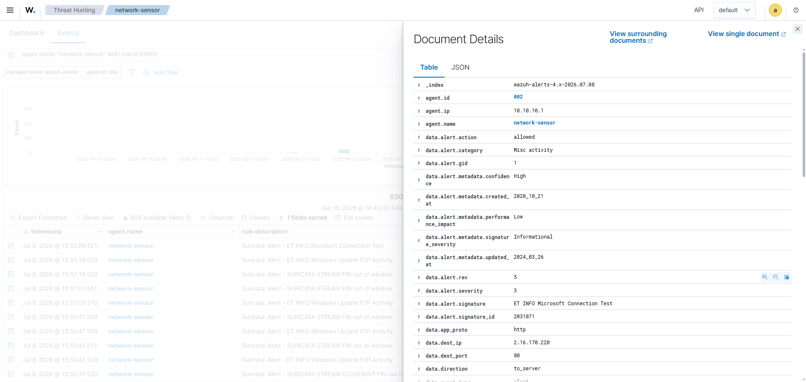
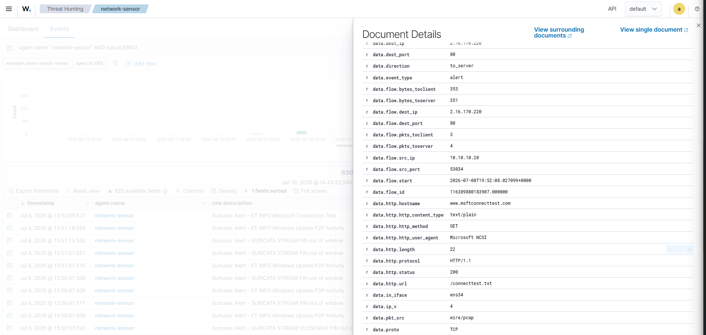
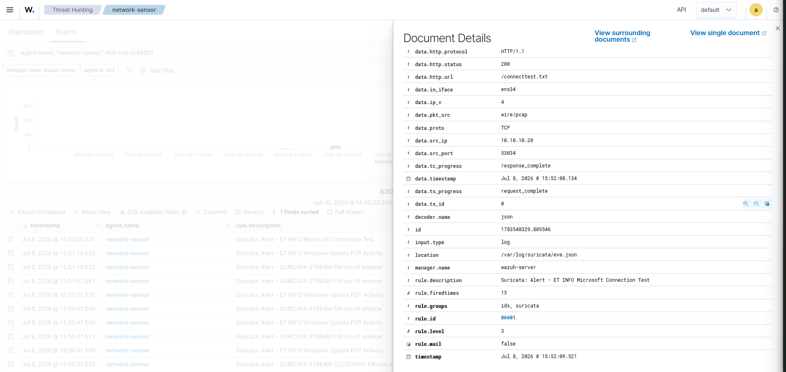
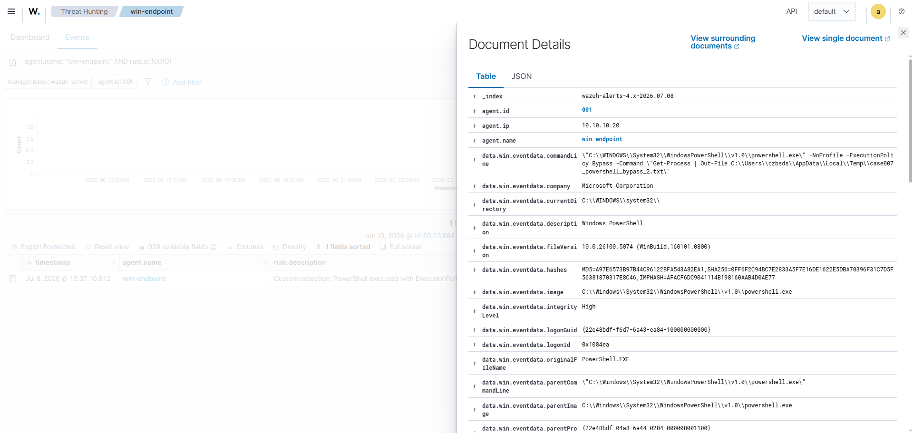
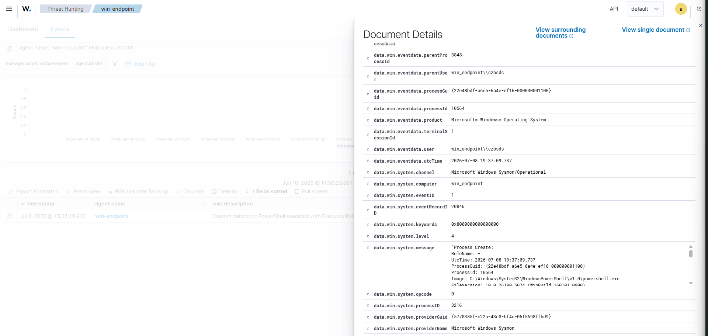
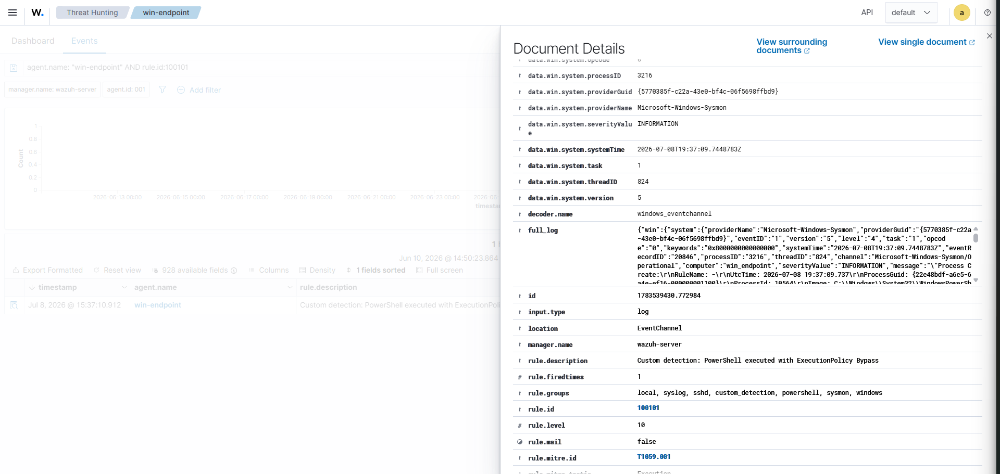

# Case 009 - False Positive Review and Detection Tuning Notes

## Objective

Review confirmed endpoint and network alerts to separate expected activity from higher-value suspicious activity, then document practical detection tuning decisions.

This case focuses on analyst judgment rather than only alert generation. The goal is to show how alerts are reviewed for context, business impact, and tuning value before being treated as incidents.

## Scope

- Wazuh Server
- Windows Endpoint: `win-endpoint`
- Network Sensor: `network-sensor`
- Data sources:
  - Sysmon EventChannel logs
  - Suricata `eve.json`
  - Wazuh custom rule output
  - Wazuh Threat Hunting

## Evidence

### Network Sensor - Microsoft Connection Test Alert







### Endpoint - Custom PowerShell Detection







## Alert Review

| Alert | Source | Key Fields | Initial Severity | Analyst Assessment | Tuning Decision |
|---|---|---|---|---|---|
| `ET INFO Microsoft Connection Test` | `network-sensor` / Suricata | `www.msftconnecttest.com`, `GET /connecttest.txt`, user-agent `Microsoft NCSI`, destination `2.16.170.220:80`, source `10.10.10.20` | Wazuh level 3 | Expected Windows connectivity check. Useful for proving network visibility, but low value as a security incident by itself. | Keep visible in the project for telemetry validation. In a production-style environment, suppress or lower priority when generated by known Windows hosts. |
| `Custom detection: PowerShell executed with ExecutionPolicy Bypass` | `win-endpoint` / Sysmon / Wazuh custom rule | Sysmon Event ID `1`, command line includes `-NoProfile -ExecutionPolicy Bypass`, user `win_endpoint\\czbsds`, rule `100101`, MITRE `T1059.001` | Wazuh level 10 | Higher-signal endpoint behavior. In this project it was test activity, but the pattern is suspicious when unexpected or paired with downloaded code, encoded commands, unusual parent process, or Defender events. | Keep as an alert. Add triage context rather than suppressing globally. Consider allowlisting only approved admin scripts after validating user, host, parent process, and command path. |

## Analyst Notes

The Suricata Microsoft Connection Test alert demonstrates that the network sensor is collecting outbound HTTP metadata from the Windows Endpoint. However, the alert is informational and maps to normal Windows network connectivity behavior. It should not be handled as an incident without additional suspicious context.

The custom PowerShell rule is different. It detects a behavior that is commonly used during script execution and attacker tradecraft: PowerShell launched with `ExecutionPolicy Bypass`. Even though this alert was generated during controlled project testing, it is useful as a detection case because the fields include host, user, process image, command line, event source, rule ID, and MITRE mapping.

The correct SOC handling is not to treat every alert equally. Low-value recurring network informational alerts should be tuned or documented as expected behavior. Endpoint detections with suspicious execution patterns should remain visible and be triaged with surrounding evidence.

## Suggested Tuning Categories

| Category | Criteria | Example From This Case | Action |
|---|---|---|---|
| Expected / Benign | Known system behavior, common destination, low severity, repeated without other suspicious evidence | Microsoft NCSI connection test | Document as expected; reduce priority if noisy |
| Needs Context | Can be benign or suspicious depending on user, parent process, script path, and surrounding events | PowerShell `ExecutionPolicy Bypass` | Investigate surrounding Sysmon, Defender, and network events |
| Keep Alerting | Strong signal, meaningful command line, maps to MITRE technique, useful for triage | Custom Wazuh rule `100101` | Keep enabled and improve runbook context |

## Useful Wazuh Queries

```text
agent.name: "network-sensor" AND rule.id:86601
```

```text
agent.name: "win-endpoint" AND rule.id:100101
```

```text
agent.name: "win-endpoint" AND data.win.system.eventID:1
```

## Outcome

Case 009 validates alert review and detection tuning logic:

- Confirmed that not every Suricata alert should become an incident.
- Identified Microsoft Connection Test as expected low-priority Windows connectivity behavior.
- Confirmed that the custom PowerShell `ExecutionPolicy Bypass` rule remains useful as a higher-signal endpoint detection.
- Documented how an analyst can separate telemetry validation, false-positive review, and real detection value.

## Status

Completed.
