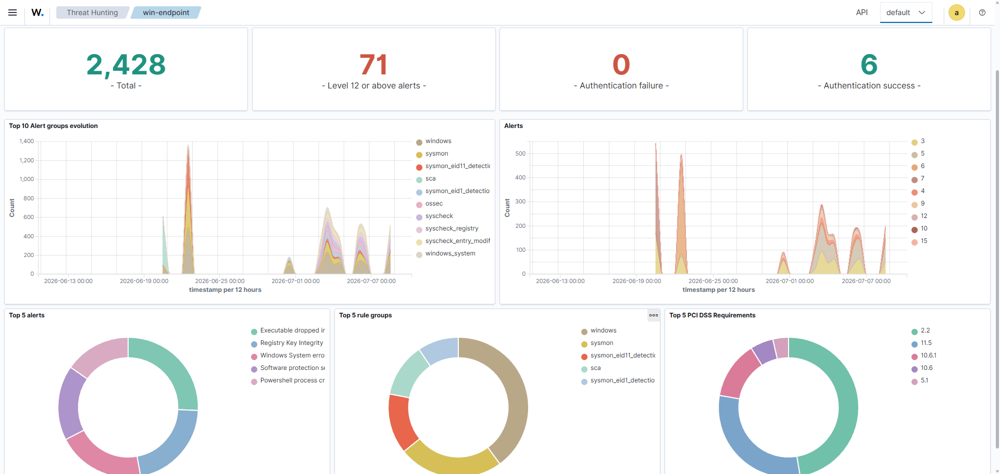
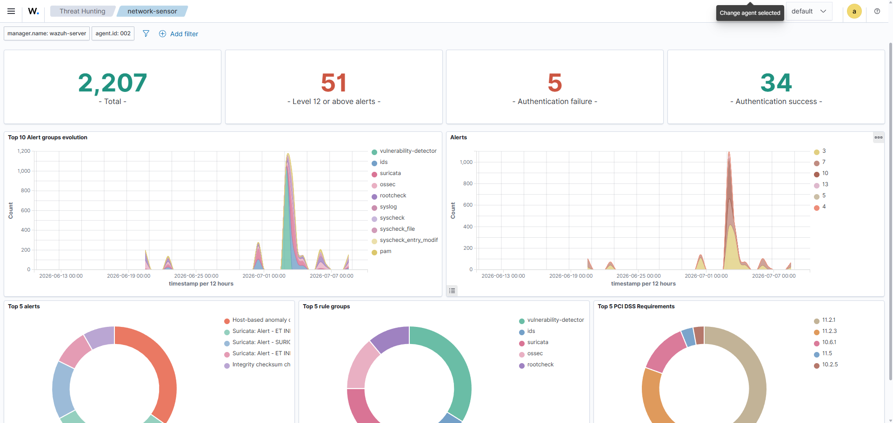
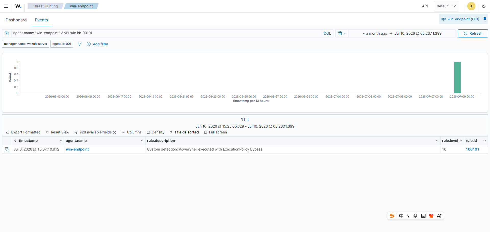

# 2026-07-10 - SOC Dashboard and Reporting Pack

## Summary

Documented Case 010 for SOC dashboard reporting. This update turns validated Wazuh telemetry into a reporting view that can be used to explain current endpoint coverage, network sensor coverage, and custom detection status.

## Completed

- Captured the `win-endpoint` Wazuh Threat Hunting dashboard overview.
- Captured the `network-sensor` Wazuh Threat Hunting dashboard overview.
- Captured a drilldown view for custom Wazuh rule `100101`.
- Documented summary metrics for endpoint and network telemetry.
- Added an analyst-facing interpretation of dashboard metrics and high-signal alerts.

## Evidence Added

### Endpoint Dashboard Overview

### Network Sensor Dashboard Overview

### Custom Rule Drilldown

## Result

The project now includes a reporting-focused SOC case. This makes the project stronger as a portfolio artifact because it demonstrates not only alert generation and investigation, but also how an analyst can summarize visibility, detection status, and triage priorities from Wazuh.

## Next Step

Use the reporting pack as the baseline for a final project summary, lessons learned, and interview-ready STAR notes.
